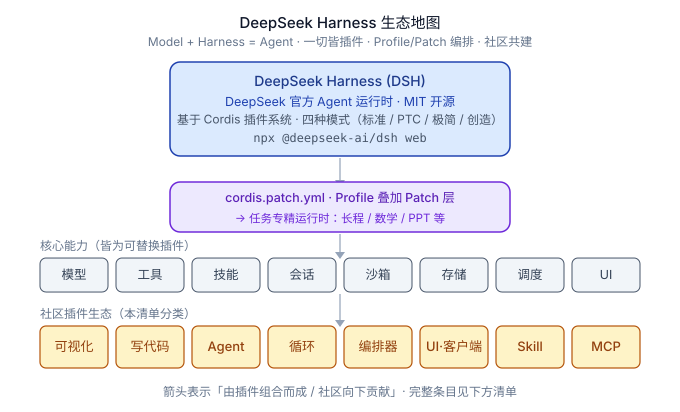

<p align="center">
  
</p>

# Awesome DeepSeek Harness [](https://awesome.re)

> 面向 **DeepSeek Harness（DSH）** 的 **插件 / Skill / MCP / 编排器 / 聚合器 / UI** 精选清单 —— DeepSeek 官方 agent 运行框架，核心理念 **`Model + Harness = Agent`**。

[English](./README.md) | **简体中文**

DeepSeek Harness（简称 "DSH"）是 DeepSeek 的 agent 运行框架 / harness 层 —— 把模型的推理变成真实行动的那双"手"（上下文管理、工具调用编排、执行沙箱、反馈循环、会话持久化）。它最大的特点是**开放的插件生态**：由社区贡献 plugin、Skill、MCP server、orchestrator、aggregator 和 UI。

本清单收录这个生态里最好的项目。欢迎贡献 —— 见 [贡献指南](#贡献指南)。

> **给作者的提示：** DeepSeek 要求插件仓库带上 **`#dsh`** GitHub topic 以便被发现。给你的仓库加上它，然后来这里提 PR。



## 快速开始

```bash
# 启动 DSH Web UI
npx @deepseek-ai/dsh web

# 把清单中的社区插件安装到指定 profile
dsh plugin --profile web add "github:owner/repo#main"
```

安装前请确认目标仓库带有 **`#dsh`** GitHub topic，便于社区 hub 收录。

## 目录

- [官方](#官方)
- [Harness 与运行时](#harness-与运行时)
- [安全与权限](#安全与权限)
- [会话与记忆管理](#会话与记忆管理)
- [成本与用量统计](#成本与用量统计)
- [Channel / IM 桥接](#channel--im-桥接)
- [插件市场与生态](#插件市场与生态)
- [可视化](#可视化)
- [幻灯片 / PPT](#幻灯片--ppt)
- [写代码](#写代码)
- [Agent](#agent)
- [循环（自动研究 / 自我改进等）](#循环自动研究--自我改进等)
- [MCP Server](#mcp-server)
- [编排器与聚合器](#编排器与聚合器)
- [UI / 客户端](#ui--客户端)
- [Skill](#skill)
- [资源](#资源)
- [贡献指南](#贡献指南)

---

## 官方

- [deepseek-ai/deepseek-harness](https://github.com/deepseek-ai/deepseek-harness) —— DeepSeek 官方 agent 运行框架（`Model + Harness = Agent`），基于 Cordis 的"一切皆插件"架构（TypeScript，MIT）。  `⭐38238`
- [deepseek-ai/awesome-deepseek-integration](https://github.com/deepseek-ai/awesome-deepseek-integration) —— 官方 DeepSeek API 集成清单。  `⭐38654`
- [deepseek-ai/awesome-deepseek-agent](https://github.com/deepseek-ai/awesome-deepseek-agent) —— 官方支持 DeepSeek 的 agent / harness 清单。  `⭐5426`

## Harness 与运行时

_DeepSeek 原生 / DeepSeek 优先的 agent harness、coding agent，以及运行时级基建（诊断、运维、会话管理、审批策略）。_

- [hxs996-beep/deepAct](https://github.com/hxs996-beep/deepAct) —— 为 DeepSeek 打造的终端 AI 编码代理，为每步行动设守卫：歧义检查、设计评审、范围控制，支持团队协作、子代理并行与 MCP 扩展。
- [LaplaceYoung/oh-my-dsh](https://github.com/LaplaceYoung/oh-my-dsh) —— 面向 DSH 的大型插件合集（700+），只通过扩展接缝注册，不修改 agent-loop 骨架。  `⭐24`
- [omdsh-dev/fabric](https://github.com/omdsh-dev/fabric) —— 类似 MC Fabric 的 hook 处理器。
- [omdsh-dev/dsh-session-health](https://github.com/omdsh-dev/dsh-session-health) —— 会话健康检查：对多帧 zstd 会话文件做帧级扫描诊断（torn / 损坏 / 空会话检测），零依赖只读，注册 `session_health` 工具。
- [omdsh-dev/dsh-security-audit](https://github.com/omdsh-dev/dsh-security-audit) —— 本机安全审计插件：覆盖配置、插件来源、会话与网络暴露面，输出只读脱敏风险报告。
- [Zhenyu98/dsh-context-doctor](https://github.com/Zhenyu98/dsh-context-doctor) —— 上下文注入审计：统计 AGENTS.md 指令链 / 技能目录 / 工具 schema 的 token 成本，检测重复与冲突；Web UI 圆环面板 + `context_audit` 工具。
- [coppynight/dsh-doctor](https://github.com/coppynight/dsh-doctor) —— flutter-doctor 风格的诊断与修复：覆盖安装级与 harness 内检查，支持安全的自动修复；repository-plugin 格式。
- [lhh010/dsh-bash-encoding](https://github.com/lhh010/dsh-bash-encoding) —— 自动识别 bash 输出编码（UTF-16LE / UTF-8 / GBK 等）并正确解码，修复 WSL / Windows 下 bash 工具的中文乱码。
- [vlln/plugin-registry](https://github.com/vlln/plugin-registry) —— 插件生态基建：管理 repository 插件的浏览器薄控制台（0 patch）+ 引导插件开发的 `make-dsh-plugin` skill。  `⭐13`
- [Andy8647/dsh-auto-approval](https://github.com/Andy8647/dsh-auto-approval) —— 工具调用自动审批：新增 `auto` 审批档位，用规则 + LLM 分类器对每次工具调用判定放行 / 拒绝，输入框旁带状态芯片。
- [zzh-newlearner/dsh-postmortem](https://github.com/zzh-newlearner/dsh-postmortem) —— 面向 DSH 会话的本地优先故障复盘（postmortem）工具。
- [vibeinging/dsh-trace](https://github.com/vibeinging/dsh-trace) —— 遥测后端：把回合、模型步骤和工具调用通过 HTTP 导出到 yiTrace。
- [omdsh-dev/dsh-hub](https://github.com/omdsh-dev/dsh-hub) —— 社区扩展目录与 Profile 生成管理器：在官方契约之上增加事务式安装、恢复、目录浏览和设置 UI。
- [fakechris/dsh-harness-ops](https://github.com/fakechris/dsh-harness-ops) —— 运维工具箱：快照 A/B 双槽升级（原子切换、一键回滚）、守护进程自动拉起 web / agent、web 全挂时一条命令自救诊断。
- [omdsh-dev/session-teleport](https://github.com/omdsh-dev/session-teleport) —— 多设备 Session 接力：以 PostgreSQL 为唯一在线权威，同一时间只有一台设备持有写入凭据。
- [Tieboyh/dsh-session-search](https://github.com/Tieboyh/dsh-session-search) —— 免索引的跨 agent 会话搜索。
- [ilharp/dsh-tool-approval](https://github.com/ilharp/dsh-tool-approval) —— 工具调用手动审批（DSH 的"手动模式 / Ask 模式"）。
- [blissito/ghostycode](https://github.com/blissito/ghostycode) —— DeepSeek V4 终端编程 agent 与“宪法式”harness（Rust TUI，支持 MCP 与子 agent）。
- [didclawapp-ai/zagens](https://github.com/didclawapp-ai/zagens) —— 面向 DeepSeek V4 的开源 agent harness。  `⭐13`
- [liubf21/ds-forge](https://github.com/liubf21/ds-forge) —— 面向 DeepSeek V4 的轻量 agent harness。
- [Owen718/FlashCoder](https://github.com/Owen718/FlashCoder) —— 面向 DeepSeek 模型的简易 harness。
- [ArtificialNotImbecile/dsh-context-taxonomy](https://github.com/ArtificialNotImbecile/dsh-context-taxonomy) —— DeepSeek Harness 的逻辑调用上下文分类（taxonomy）插件。
- [btspoony/dsh-llm-fallbacks](https://github.com/btspoony/dsh-llm-fallbacks) —— 基于角色的模型重试与备用（fallback）策略插件。
- [Drifter-yh/dsh-tool-policy](https://github.com/Drifter-yh/dsh-tool-policy) —— 声明式默认拒绝（deny-by-default）工具策略插件。
- [LingLambda/dsh-undo](https://github.com/LingLambda/dsh-undo) —— 上下文撤销/重做：把模型上下文回滚到上一个完成步骤，并可再恢复。
- [omdsh-dev/omdsh](https://github.com/omdsh-dev/omdsh) —— 社区实验项目：以可审阅、可复现的形式组织版本化的 DSH 组件集与默认配置。
- [omdsh-dev/omdsh-runtime](https://github.com/omdsh-dev/omdsh-runtime) —— 无头执行层：复用官方 Profile/Bundle/Cordis 操作，增加确定性 plan/apply、候选代次与上一代恢复。
- [wangshunnn/oh-my-dsh](https://github.com/wangshunnn/oh-my-dsh) —— DeepSeek Harness 插件合集。
- [yjh051108/dsh-super-injector](https://github.com/yjh051108/dsh-super-injector) —— BepInEx 式模组注入器：运行时把本地插件包热注入运行中的 DSH web，不改 patch、不重启。
- [yoke233/dsh-openai-codex-auth](https://github.com/yoke233/dsh-openai-codex-auth) —— OpenAI Codex OAuth 登录与用量卡片插件。
- [YYTbit/dsh-plugin-claude-bridge](https://github.com/YYTbit/dsh-plugin-claude-bridge) —— 把 Claude Code 的记忆、技能与配置桥接进 DeepSeek Harness。
- [Gordonynh/dsh-plugin-codex-import](https://github.com/Gordonynh/dsh-plugin-codex-import) —— 导入 Codex 历史对话记录到 DSH。
- [Hu9956/dsh-codex-provider](https://github.com/Hu9956/dsh-codex-provider) —— Codex 供应商接入插件（支持 OAuth 登录）。
- [WSL043/dsh-codex-subscription](https://github.com/WSL043/dsh-codex-subscription) —— 缓存 Codex 订阅/用量状态。
- [PerryLink/dsh-output-styles](https://github.com/PerryLink/dsh-output-styles) —— 切换不同的输出风格。
- [Toukaiteio/dsh-effort-tweak](https://github.com/Toukaiteio/dsh-effort-tweak) —— 实时调整 reasoning effort。
- [csiroqa/dsh-backup-sync](https://github.com/csiroqa/dsh-backup-sync) —— 工作区快照备份与 WebDAV 同步。
- [csiroqa/dsh-schedule](https://github.com/csiroqa/dsh-schedule) —— cron 定时任务 + 状态监控。
- [Karuisawa-Mrs/dsh-plugins](https://github.com/Karuisawa-Mrs/dsh-plugins) —— 社区插件合集。
- [BlockRunAI/dsh-clawrouter](https://github.com/BlockRunAI/dsh-clawrouter) —— 为你的 DeepSeek Harness agent 提供“第二大脑”：危险工具调用前的强模型复审，以及一个钱包接入 70+ 模型。
- [gordonlu/dsh-context-lens](https://github.com/gordonlu/dsh-context-lens) —— DeepSeek Harness 的请求上下文分析器：查看每次模型请求间到底变了什么、缓存命中如何变化。
- [green-dalii/dsh-shift-router](https://github.com/green-dalii/dsh-shift-router) —— DeepSeek Harness 的两层模型路由：LLM-Judge 路由、多模型降级链、指数退避失败重试、任务级编排。
- [KitDoesIt/dsh-compaction-instant](https://github.com/KitDoesIt/dsh-compaction-instant) —— 不依赖 LLM 的无损压缩引擎。
- [morlay/session-persistence-rdb](https://github.com/morlay/session-persistence-rdb) —— session 关系型数据库持久化。
- [rainforest888/dsh-plugins-raincode](https://github.com/rainforest888/dsh-plugins-raincode) —— DeepSeek Harness 的模型层：模型池/缓存/重试 + `/skills` 浏览。
- [weijiafu14/dsh-remote-sandbox](https://github.com/weijiafu14/dsh-remote-sandbox) —— 基于 E2B 沙盒的抗崩溃远程执行编星：`ctx.fs`/`ctx.subprocess`，带心跳保活、透明恢复与工作区同步。

## 安全与权限

_权限规则、审批复核、安全审计与调用前 policy-check 插件。_

- [PerryLink/dsh-permission-rules](https://github.com/PerryLink/dsh-permission-rules) —— Claude Code 式声明权限规则（allow/deny/ask）。
- [PerryLink/dsh-auto-review](https://github.com/PerryLink/dsh-auto-review) —— 二次模型自动审核 approval 请求。
- [PerryLink/dsh-skill-pack-security](https://github.com/PerryLink/dsh-skill-pack-security) —— 安全审计 skill 包（密钥扫描/依赖审计）。
- [agentic-control-plane/dsh-acp-plugin](https://github.com/agentic-control-plane/dsh-acp-plugin) —— 工具调用前的 policy-check。
- [securstack/securstack-dsh-plugin](https://github.com/securstack/securstack-dsh-plugin) —— 仓库安全扫描适配器。
- [Areium/dsh-fail-logger](https://github.com/Areium/dsh-fail-logger) —— 自动记录工具调用失败原因并沉淀改进建议。
- [lonelymoon87/dsh-guardian](https://github.com/lonelymoon87/dsh-guardian) —— DeepSeek Harness 的运行时工具策略、危险命令拦截与输出脱敏。

## 会话与记忆管理

_跨会话记忆、checkpoint、会话置顶与导航插件。_

- [PerryLink/dsh-memento](https://github.com/PerryLink/dsh-memento) —— 基于 SQLite 的有界跨会话记忆。
- [Spirtxiaoqi7/mindspace-dsh-session-memory](https://github.com/Spirtxiaoqi7/mindspace-dsh-session-memory) —— 会话隔离的个性化记忆。
- [PerryLink/dsh-checkpoint-rewind](https://github.com/PerryLink/dsh-checkpoint-rewind) —— git 快照 checkpoint + `/rewind` 命令回滚。
- [alooshxl/dsh-session-pins](https://github.com/alooshxl/dsh-session-pins) —— 会话置顶菜单。
- [PerryLink/dsh-session-pin](https://github.com/PerryLink/dsh-session-pin) —— 会话置顶。
- [malevrigns/dsh-session-stars](https://github.com/malevrigns/dsh-session-stars) —— 收藏会话。
- [XiLuovo/dsh-session-timeline](https://github.com/XiLuovo/dsh-session-timeline) —— 会话时间轴 UI。
- [unnnnoooo/dsh-cue-plugin](https://github.com/unnnnoooo/dsh-cue-plugin) —— 跨会话引用/cue。
- [Amengclass/dsh-memory](https://github.com/Amengclass/dsh-memory) —— 持久化、可被模型编辑的记忆/笔记存储：新增 `memory_set`/`get`/`delete`/`search` 工具，基于 `ctx.storageDomain` 跨会话保存事实。
- [Bleed00/dsh-claude-mem](https://github.com/Bleed00/dsh-claude-mem) —— 集成 claude-mem 的 DeepSeek Harness 记忆插件。
- [PerryLink/dsh-claude-move](https://github.com/PerryLink/dsh-claude-move) —— 将 Claude Code 会话、记忆、skills 与 CLAUDE.md 迁移进 DSH，无缝恢复。

## 成本与用量统计

_token 用量、成本看板与预算告警插件。_

- [boNeXY226/dsh-cost-chip](https://github.com/boNeXY226/dsh-cost-chip) —— `/cost` 命令 + 悬浮费用胶囊，展示会话花费。
- [misakimiku2/dsh-cost-display](https://github.com/misakimiku2/dsh-cost-display) —— 成本显示。
- [suimi8/dsh-cost-ledger](https://github.com/suimi8/dsh-cost-ledger) —— 成本账本。
- [csiroqa/dsh-plugin-usage-report](https://github.com/csiroqa/dsh-plugin-usage-report) —— 日/月用量报表（token + 费用 + 预算告警 + 贡献格）。
- [H1a3x/dsh-token-stats](https://github.com/H1a3x/dsh-token-stats) —— 悬浮 token 用量统计面板。
- [xinmo114514/dsh-usage-widget](https://github.com/xinmo114514/dsh-usage-widget) —— 用量悬浮 widget。
- [Han-1413141/dsh-cost-meter](https://github.com/Han-1413141/dsh-cost-meter) —— DeepSeek Harness 会话费用统计插件：本会话费用、当日费用、历史记录与官方价格同步。
- [jelly-000/dsh-balance-monitor](https://github.com/jelly-000/dsh-balance-monitor) —— DeepSeek 账户余额、剩余比例条与今日花费，展示在 dsh 侧边栏底部。

## Channel / IM 桥接

_把 DSH 桥接到各种聊天平台与消息通道。_

- [PlutoKeating/dsh-lark-bot](https://github.com/PlutoKeating/dsh-lark-bot) —— 飞书桥接。
- [Roy-oss1/dsh-lark](https://github.com/Roy-oss1/dsh-lark) —— 飞书桥接。
- [TtTRz/dsh-wecom](https://github.com/TtTRz/dsh-wecom) —— 企业微信 bot。
- [congchuanling-dot/DSH-Telegram-Relay](https://github.com/congchuanling-dot/DSH-Telegram-Relay) —— Telegram 中继。
- [STARDUSTLC666/dsh-email](https://github.com/STARDUSTLC666/dsh-email) —— 邮件工具。
- [BeAChanger/dsh-openclaw-acp](https://github.com/BeAChanger/dsh-openclaw-acp) —— 适配 OpenClaw 与微信（基于 ACP）的 DeepSeek Harness 插件包。
- [gnulife/dsh-plugin-wechat](https://github.com/gnulife/dsh-plugin-wechat) —— DeepSeek Harness 的微信桥接插件（通过 ClawBot）。
- [sindo-s/dsh-qq-bot](https://github.com/sindo-s/dsh-qq-bot) —— 将 QQ 官方 Bot API 桥接到 dsh agent，无需第三方 bot 框架。
- [wssfk12138/dsh-wechat-notify](https://github.com/wssfk12138/dsh-wechat-notify) —— 为 agent 新增 `wechat_notify` 工具，让 AI 通过本机 ClawBot 微信通道主动发通知（任务完成/需决策时），中文可靠、掉线自提示。
- [xiaoshihou514/dsh-weixin](https://github.com/xiaoshihou514/dsh-weixin) —— DeepSeek Harness 的微信桥接。

## 插件市场与生态

_插件市场、安装管理器、索引与生态工具。_

- [bradeGithub/DSH-Plugins-Marketplace](https://github.com/bradeGithub/DSH-Plugins-Marketplace) —— 插件市场 GUI。
- [LX2000WASD/dsh-web-plugin-manager](https://github.com/LX2000WASD/dsh-web-plugin-manager) —— 网页插件管理器。
- [Toukaiteio/dsh-plugin-installer](https://github.com/Toukaiteio/dsh-plugin-installer) —— 插件安装器。
- [Sunrisepeak/dsh-index](https://github.com/Sunrisepeak/dsh-index) —— 插件索引。
- [akira399/dsh-plugin-publisher](https://github.com/akira399/dsh-plugin-publisher) —— 插件发布工作流。
- [nightwhale-dev/nightwhale](https://github.com/nightwhale-dev/nightwhale) —— 生态聚合。
- [ZK-Andy/dsh-continual-evolve](https://github.com/ZK-Andy/dsh-continual-evolve) —— 自我进化插件。
- [green-dalii/dsh-plugin-dev-skill](https://github.com/green-dalii/dsh-plugin-dev-skill) —— DeepSeek Harness 插件开发 skill：让任何 Agent 都能正确、高效、合规地开发 DSH 插件，含精简参考文档与论文解读。

## 可视化

_把数据 / 结果变成图表、图形、看板的插件。_

- [ZSeven-W/dsh-openpencil](https://github.com/ZSeven-W/dsh-openpencil) —— OpenPencil 设计稿预览与编辑插件。  `⭐33`
- [omdsh-dev/dsh-genui](https://github.com/omdsh-dev/dsh-genui) —— 通过 `dsh-ui` 代码栅栏在回复中内联渲染可交互 UI 组件：布局、图表、绘图、表单、测验、mermaid、3D 场景，并把交互事件回传给模型。  `⭐14`
- [william-jin-cmu/dsh-vision](https://github.com/william-jin-cmu/dsh-vision) —— `view_image` 工具：把任意 OpenAI 兼容 VLM 桥接给纯文本模型。  `⭐10`
- [omdsh-dev/dsh-ernie-image](https://github.com/omdsh-dev/dsh-ernie-image) —— 百度 ERNIE-Image-Turbo 文生图：宿主端图像生成工具 + 浏览器画廊面板与配置卡。
- [omdsh-dev/dsh-paddle-ocr](https://github.com/omdsh-dev/dsh-paddle-ocr) —— 百度 PaddleOCR-VL 文档版面解析：把 PDF/图片逐页解析为 Markdown，含宿主工具、配置卡与任务面板。
- [PangYiMing/dsh-screenshot-diff](https://github.com/PangYiMing/dsh-screenshot-diff) —— 用 pixelmatch 对两张截图做像素级对比，输出 diff 图与三联图。
- [Kevoyuan/dsh-mac-vision](https://github.com/Kevoyuan/dsh-mac-vision) —— macOS 原生 OCR/Vision 框架集成。
- [MC5lan/dsh-multimodal](https://github.com/MC5lan/dsh-multimodal) —— 视觉转写 + 文生图整合。
- [loudMore/dsh-drop-to-path](https://github.com/loudMore/dsh-drop-to-path) —— 把拖放的图片/文件转为路径，交给纯文本模型。
- [Yuuz12/dsh-vision-helper](https://github.com/Yuuz12/dsh-vision-helper) —— 视觉辅助插件。
- [ysr666/dsh-vision-router](https://github.com/ysr666/dsh-vision-router) —— 视觉请求路由。
- [pinch-eng/dsh-audio-dub](https://github.com/pinch-eng/dsh-audio-dub) —— 视频/音频配音工具。
- [LuZhouheng/dsh-gen3d](https://github.com/LuZhouheng/dsh-gen3d) —— DeepSeek Harness 3D 角色生成插件：直连 Meshy / Hunyuan3D / Tripo3D / Rodin 官方 API，自配 key，mock 回退。
- [wangyang10/image-vision](https://github.com/wangyang10/image-vision) —— DeepSeek Harness 的图像/视觉 skill 插件。
- [xiaoshihou514/dsh-vision](https://github.com/xiaoshihou514/dsh-vision) —— DeepSeek Harness 的视觉桥接。
- [Hyperionjust/dsh-tool-underseal](https://github.com/Hyperionjust/dsh-tool-underseal) —— 面向 DeepSeek Harness 的封存式工具插件（支持多模型）。
- [hccccc01333/dsh-report-html](https://github.com/hccccc01333/dsh-report-html) —— 从 Markdown、表格、图表、中国地图、流程图、公式与可钻担表格生成自包含交互式 HTML 报告。
- [yumimanji/dsh-ui-spec](https://github.com/yumimanji/dsh-ui-spec) —— 把 UI 截图转化为可用于实现的前端规格：确定性几何解析（sharp）+ 可选视觉模型语义，合并为一份 JSON + Markdown 规格。

## 幻灯片 / PPT

_生成演示文稿、幻灯片、导出 PPT。_

- [THU-MAIC/dsh-openmaic](https://github.com/THU-MAIC/dsh-openmaic) —— OpenMAIC for DSH：课堂、幻灯片、交互组件与苏格拉底式教学。

## 写代码

_代码生成、重构、审查、仓库级工程插件。_

- [omdsh-dev/dsh-open-in-vscode](https://github.com/omdsh-dev/dsh-open-in-vscode) —— 从 Web GUI 直接在 VS Code 中打开 DSH 工作区目录。  `⭐33`
- [omdsh-dev/dsh-custom-tool](https://github.com/omdsh-dev/dsh-custom-tool) —— 用 Monaco 编辑器创建和管理沙箱化 JavaScript 工具，工具生命周期由模型驱动。  `⭐18`
- [CanglongCl/dsh-web-review](https://github.com/CanglongCl/dsh-web-review) —— DSH Web GUI 的网页预览与元素批注插件，让 AI 根据可视化反馈直接修改前端源码。
- [omdsh-dev/dsh-plugin-check](https://github.com/omdsh-dev/dsh-plugin-check) —— 插件健康检查：扫描插件仓库的清单协议 / patch 格式 / 构建陷阱 / hub 收录状态，零依赖只读，注册 `plugin_check` 工具。  `⭐11`
- [omdsh-dev/plugin-template](https://github.com/omdsh-dev/plugin-template) —— 基于官方 turtle-ui 插件仓库创建的插件模板。
- [a179-sanae/dsh-code-check](https://github.com/a179-sanae/dsh-code-check) —— 自动类型检查诊断：模型改完代码后后台运行 `tsc --noEmit`，并注册 `code_check` 工具。
- [FlashingChen/dsh-worktree](https://github.com/FlashingChen/dsh-worktree) —— Codex 风格常驻 git worktree：创建/列出/删除工具、`/worktree` 命令与按仓库持久化清单。
- [PangYiMing/dsh-batch-regression](https://github.com/PangYiMing/dsh-batch-regression) —— 批量回归：把命令跑 N 轮，按中位数/分布取统计结论。
- [PangYiMing/dsh-bisect-debug](https://github.com/PangYiMing/dsh-bisect-debug) —— 二分法定位 bug 根因（代码 / 边界 / commit）。
- [PangYiMing/dsh-port-guard](https://github.com/PangYiMing/dsh-port-guard) —— 端口占用处置：复用、换端口或精准杀掉占用进程。
- [PerryLink/dsh-lsp-actions](https://github.com/PerryLink/dsh-lsp-actions) —— LSP 诊断/格式化动作。
- [lonelymoon87/dsh-code-intel](https://github.com/lonelymoon87/dsh-code-intel) —— DeepSeek Harness 的符号感知代码索引与混合检索。
- [lonelymoon87/dsh-gitflow](https://github.com/lonelymoon87/dsh-gitflow) —— DeepSeek Harness 的 git status/diff/commit/PR/worktree 工作流。
- [lonelymoon87/dsh-specflow](https://github.com/lonelymoon87/dsh-specflow) —— DeepSeek Harness 的规格驱动开发工具包。
- [lonelymoon87/dsh-vscode](https://github.com/lonelymoon87/dsh-vscode) —— DeepSeek Harness SDK 运行时的 VS Code 客户端。
- [liuup/dsh-latex-tools](https://github.com/liuup/dsh-latex-tools) —— 在 DeepSeek Harness 中复制与导出 LaTeX：悬停任意公式即可复制 TeX 源码或导出为独立 SVG 文件。
- [MOLAaaaaaaa/dsh-seismicx](https://github.com/MOLAaaaaaaa/dsh-seismicx) —— SeismicX 地震目录 skill 的 DeepSeek Harness 插件。
- [shyboy/dsh-k12-lesson-builder](https://github.com/shyboy/dsh-k12-lesson-builder) —— 生成图文同步的 K12 英语课件 PPTX 与 DOCX 的 DeepSeek Harness 插件。

## Agent

_可在 DSH 内运行的可复用子 agent / 专用 agent 包。_

- [hewzhew/dsh-agent-rp](https://github.com/hewzhew/dsh-agent-rp) —— SillyTavern 迁移与新一代 Agent 角色扮演（RP）。  `⭐67`
- [whiteguo233/dsh-openbiliclaw](https://github.com/whiteguo233/dsh-openbiliclaw) —— 把本地个性化内容推荐 Agent OpenBiliClaw 装进 DSH：界面常驻第四栏，注册 22 个 Agent Bridge 工具，让 Agent 读推荐、答探测、闭环学习。
- [omdsh-dev/dsh-data-agent](https://github.com/omdsh-dev/dsh-data-agent) —— 让 AI 帮你连数据库、写 SQL 的插件。
- [omdsh-dev/dsh-mnemon](https://github.com/omdsh-dev/dsh-mnemon) —— Mnemon 深度集成插件：提供三层本地记忆能力 —— Runtime Memory、可检索 Documents 与受监督 Memory Spaces。
- [nowledge-co/nowledge-mem-deepseek-harness](https://github.com/nowledge-co/nowledge-mem-deepseek-harness) —— Nowledge Mem 社区插件包。
- [btspoony/dsh-advisor](https://github.com/btspoony/dsh-advisor) —— 搭配一个副模型，被动审查每轮对话并注入见解。
- [fakechris/dsh-track](https://github.com/fakechris/dsh-track) —— 嵌入式任务管理引擎：决策点协议、念头捕获墙、Linear 形 issue 存储，供 AI 与人共用。
- [Fisfzy/ego-browser](https://github.com/Fisfzy/ego-browser) —— 把 ego-lite（面向 AI Agent 的 Chromium 浏览器）接入 DSH：13 个结构化 `ego_*` 工具（文本语义快照、语义定位点击、表单填充、截图、CDP 控制），内置运行时开箱即用。
- [omdsh-dev/dsh-longbridge](https://github.com/omdsh-dev/dsh-longbridge) —— 长桥（Longbridge）OpenAPI 港美股接入：行情、账户与交易工具 + 设置页凭据管理。
- [omdsh-dev/dsh-tool-browser](https://github.com/omdsh-dev/dsh-tool-browser) —— 官方 `dsh-tool-browser` 浏览器控制工具的静态 Cordis overlay 与集成指南。
- [PangYiMing/dsh-browser-control](https://github.com/PangYiMing/dsh-browser-control) —— 操控浏览器插件（CDP/Playwright）。
- [PangYiMing/dsh-mobile-control](https://github.com/PangYiMing/dsh-mobile-control) —— 操控手机设备插件（ADB/iOS）。
- [titanwings/dsh-better-browser](https://github.com/titanwings/dsh-better-browser) —— 通过 13 个 Kimi WebBridge 工具，让 Agent 操作用户已登录的真实浏览器。
- [UynajGI/dsh-ssh](https://github.com/UynajGI/dsh-ssh) —— SSH 远程执行插件：ProxyJump 链、SFTP 文件系统、基于 ssh2 的子进程与 PTY。
- [whiteguo233/OpenBiliClaw](https://github.com/whiteguo233/OpenBiliClaw) —— 本地优先的跨平台内容发现 Agent（B站/小红书/YouTube/X 等），并提供 DSH 客户端插件。  `⭐1926`
- [zenx0x/allinluna](https://github.com/zenx0x/allinluna) —— 面向 Codex 与 DeepSeek Harness 的资源感知式多代理编排（“All in Flash” DSH 插件）。  `⭐22`
- [zcx369658780/governed-workflow-for-dsh](https://github.com/zcx369658780/governed-workflow-for-dsh) —— 面向 DeepSeek Harness agent 的策略强制、证据优先的受治工作流。

## 循环（自动研究 / 自我改进等）

_长时运行的循环工作流：自动研究、深度调研、自我精炼、迭代构建。_

- [btspoony/mstar-harness](https://github.com/btspoony/mstar-harness) —— Skill 驱动的 Harness / Loop 工程化工作流 agent 插件。  `⭐39`
- [csyangwen/dsh-memory-evolve](https://github.com/csyangwen/dsh-memory-evolve) —— 纯插件实现的跨会话长期记忆 + 后台自我进化：五轨记忆、回合内自我审查、技能自我进化与技能管理器、四轨待办、会话搜索 —— 零核心修改、零运行时依赖。  `⭐14`
- [vlln/dsh-loop](https://github.com/vlln/dsh-loop) —— 定时循环插件（`/loop` 命令 + loop 工具 + 活动状态条）。
- [william-jin-cmu/dsh-evolve](https://github.com/william-jin-cmu/dsh-evolve) —— 自进化插件：在会话内热挂载/卸载 Cordis 插件。
- [fuhefei/dsh-sentinel](https://github.com/fuhefei/dsh-sentinel) —— 条件驱动唤醒：持久化的文件/命令/HTTP/进程/webhook 监视，触发即唤醒 agent，含 dock 与全局仪表盘。
- [lzszq/dsh-scholar](https://github.com/lzszq/dsh-scholar) —— 面向纯计算研究的 AI 科研工作台：研究资料、项目对话、代码数据、实验运行、证据账本与 TeX 手稿放在同一个可恢复项目中。
- [omdsh-dev/dsh-revive](https://github.com/omdsh-dev/dsh-revive) —— 一键复活：重启后自动给所有被打断的会话发送「继续」（`/revive` 命令 + 工具 + 浏览器按钮）。

## MCP Server

_向 DSH 贡献工具 / prompt / 资源的 Model Context Protocol server。_

<!-- 在此添加条目。 -->
- [taxueseek/argo](https://github.com/taxueseek/argo) —— 为 agent 打造的多语言搜索工具（网页/学术/代码/金融/新闻），附带 DSH 插件包，提供 10 个 `mcp__argo__*` 工具。  `⭐56`
- [chushixixin/dsh-harness-mcp-server](https://github.com/chushixixin/dsh-harness-mcp-server) —— 把 DSH 本身暴露为 MCP server。
- [f0909172434/dsh-plugin-verified-search](https://github.com/f0909172434/dsh-plugin-verified-search) —— 验证式搜索插件。
- [qwased/dsh-web-search-duckduckgo](https://github.com/qwased/dsh-web-search-duckduckgo) —— DuckDuckGo 网页搜索 MCP 工具。
- [gxpppp/dsh-search-mcp](https://github.com/gxpppp/dsh-search-mcp) —— 用搜索 MCP server（Tavily/Brave/Exa/Perplexity/DuckDuckGo/自定义）替换 dsh 内置的网页搜索，在 Web 设置页配置。
- [anweat/dsh-web-search-pro](https://github.com/anweat/dsh-web-search-pro) —— DeepSeek Harness 的强化持久化网页搜索插件：多引擎搜索、SQLite+LRU 缓存、平台后端与 Playwright 渲染。
- [lmcsh9527/dsh-search-free](https://github.com/lmcsh9527/dsh-search-free) —— 免费的多层网页搜索 + fetch 提供商（Exa → Tavily → Bing + web_fetch）。

## 编排器与聚合器

_多步 / 多 agent 调度器与输出聚合器。_

- [icetomoyo/dsh_workflow](https://github.com/icetomoyo/dsh_workflow) —— 把 DSH 的一次性多 Agent 调度升级为可生成、可保存、可治理、可观察、可恢复的 Workflow 层（UltraCode 风格）。  `⭐35`
- [NanmiCoder/dsh-agent-teams](https://github.com/NanmiCoder/dsh-agent-teams) —— AgentTeams 多 agent 团队插件。  `⭐72`
- [Chinesezjc/dsh-interconnect](https://github.com/Chinesezjc/dsh-interconnect) —— DSH 跨实例消息 / 事件接力插件（互联服务 + 工具）。  `⭐15`
- [titanwings/dsh-automation](https://github.com/titanwings/dsh-automation) —— 自动化插件：让 Coding 任务按计划在全新 Agent Session 中运行，定时任务可由用户或 Agent 创建和管理。
- [Buyi-wsgzg/dsh-sidechain](https://github.com/Buyi-wsgzg/dsh-sidechain) —— 侧会话插件：`/side` 持续性侧会话（Codex 风格）与 `/btw` 一次性侧问（Claude 风格），在临时 fork 中运行、不写入主会话历史，Web UI 右侧面板内嵌对话。
- [omdsh-dev/dsh-hub-workshop](https://github.com/omdsh-dev/dsh-hub-workshop) —— OMDSH 生态的公共 catalog、评审投影与不可变 feed 权威源。
- [TtTRz/dsh-gatedflow](https://github.com/TtTRz/dsh-gatedflow) —— 人机协同工作流引擎。
- [franksong2702/dsh-codex-connect](https://github.com/franksong2702/dsh-codex-connect) —— 为 DeepSeek Harness 提供 ChatGPT OAuth 与 Codex 模型接入。
- [ropon/dsh-plugin-clawrouters](https://github.com/ropon/dsh-plugin-clawrouters) —— DeepSeek Harness 的一键 ClawRouters 插件：对话、图像、视频与网页搜索。

## UI / 客户端

_DSH 的桌面、网页、终端或编辑器前端。_

- [zhu1090093659/dsh-web-ui](https://github.com/zhu1090093659/dsh-web-ui) —— DSH Web UI 插件与皮肤合集：任务看板、git graph、右侧面板、远程移动端 UI、宠物、实时 token 统计与皮肤中心。  `⭐506`
- [huiliyi37/dsh-tianshu-tui](https://github.com/huiliyi37/dsh-tianshu-tui) —— DeepSeek Harness 终端 UI（天枢 TUI）。  `⭐73`
- [omdsh-dev/DSH-better-sidebar](https://github.com/omdsh-dev/DSH-better-sidebar) —— 侧边栏完整工作台：支持三方扩展注册新 Tab，内置文件渲染编辑 / 终端 / Git / 子代理。  `⭐127`
- [ccch1mneyyy/dsh-cc-tui](https://github.com/ccch1mneyyy/dsh-cc-tui) —— Claude Code 风格全屏交互终端：像素鲸鱼顶栏、思考流式展开、双击 Esc 回滚、上下文进度条 + TPS 仪表。  `⭐197`
- [Small-tailqwq/dsh-deep-whale](https://github.com/Small-tailqwq/dsh-deep-whale) —— DSH Web 鲸鱼娘皮肤系列（深海女仆工坊 maid-atelier），CC BY-NC-SA 4.0。  `⭐119`
- [hust-open-atom-club/oh-dsh-desktop](https://github.com/hust-open-atom-club/oh-dsh-desktop) —— 可扩展的 macOS 工作台：原生 PTY、工作区工具、双语实时插件、隔离预览的插件市场。
- [omdsh-dev/dsh-at-file](https://github.com/omdsh-dev/dsh-at-file) —— Codex 风格 `@file` 引用：在输入框中搜索工作区文件并把内容附加到 prompt。  `⭐25`
- [omdsh-dev/dsh-notification](https://github.com/omdsh-dev/dsh-notification) —— 回合完成桌面通知：按结果分别控制，支持关键词包含 / 排除规则。  `⭐25`
- [alingalingling/ui-status-label](https://github.com/alingalingling/ui-status-label) —— 把思考时的 "deep diving" 状态文案自定义成任意你想要的样子。  `⭐21`
- [Anionex/dsh-turn-rewind](https://github.com/Anionex/dsh-turn-rewind) —— 对话回退插件：回退对话与工作区状态，基于持久化 Change Ledger。  `⭐23`
- [bobleer/dsh-acp-for-bitfun](https://github.com/bobleer/dsh-acp-for-bitfun) —— BitFun 与 DSH 的 ACP 交互对接插件。
- [Moeblack/dsh-message-edit](https://github.com/Moeblack/dsh-message-edit) —— 基于分支的消息编辑、重roll、重试与版本时间线。  `⭐11`
- [Lum1104/dsh-browser](https://github.com/Lum1104/dsh-browser) —— Chrome 侧边栏扩展：用 DSH 直接操作浏览器，0 视觉能力依赖。  `⭐26`
- [hellodigua/dsh-share](https://github.com/hellodigua/dsh-share) —— 对话分享插件，一键分享你的对话。  `⭐11`
- [chen-001/dsh-grok-tui](https://github.com/chen-001/dsh-grok-tui) —— 通过 grok-build 的 TUI 使用 DSH。
- [ccq1/dsh-side-panel](https://github.com/ccq1/dsh-side-panel) —— DSH 侧边栏：集成文件浏览器、终端和 Git 审查，方便预览文件。
- [lhh010/dsh-ui-whale](https://github.com/lhh010/dsh-ui-whale) —— 全手绘像素鲸鱼伙伴：会话标题栏常驻，平时眨眼摆尾、思考时持续动起来、回合完成头顶喷水，零核心改动。  `⭐16`
- [lhh010/dsh-ui-progress](https://github.com/lhh010/dsh-ui-progress) —— 会话进度插件：输入框停靠区常驻进度条（todos 真实进度 / 实时 token 生成速率 / 中断状态 / 待办提醒），零核心改动。
- [omdsh-dev/dsh-annotation](https://github.com/omdsh-dev/dsh-annotation) —— Web 选中批注插件：选文字 → 批注 → 随消息发送，回复按批注逐条对照。  `⭐18`
- [Ruler4396/dsh-launcher](https://github.com/Ruler4396/dsh-launcher) —— 轻量 Windows 启动器：登录时静默自启 + 极简 WebView2 窗口，替代完整浏览器。  `⭐21`
- [renat3u/dsh-web-archive](https://github.com/renat3u/dsh-web-archive) —— 折叠对话中的"无用消息"（如 Think、Bash 输出等）。
- [renat3u/dsh-paseo](https://github.com/renat3u/dsh-paseo) —— 把 DSH 注册为 Paseo 的 ACP provider：在 Paseo 桌面 / Web / 手机客户端里并行运行和管理多个 DSH agent。
- [Small-tailqwq/dsh-deepcel](https://github.com/Small-tailqwq/dsh-deepcel) —— 一款模仿 Excel 的 DSH 皮肤。
- [titanwings/dsh-plannotator](https://github.com/titanwings/dsh-plannotator) —— 计划批注插件：选中计划原文、逐条批注，并把结构化反馈送回 Agent。
- [vibeinging/dsh-work](https://github.com/vibeinging/dsh-work) —— 本地优先的 Electron 工作台：整合 Agent 会话、项目文件、数据分析、网络调研、MCP 与 Office 产物。
- [whiteguo233/dsh-cc-connect](https://github.com/whiteguo233/dsh-cc-connect) —— 通过 CC Connect 远程使用 DSH。
- [dbydd/dsh-onlyne](https://github.com/dbydd/dsh-onlyne) —— 通过 Onlyne（工作区本地 IM 通道守护进程）给 DSH agent 一个真正的 IM 收发件箱：Telegram、飞书、QQ 机器人、微信。
- [LaplaceYoung/dsh-qq2006](https://github.com/LaplaceYoung/dsh-qq2006) —— QQ2006 皮肤插件：注册 `qq2006` 主题、全局皮肤表与完整素材。
- [vlln/whale-girl](https://github.com/vlln/whale-girl) —— Web GUI 桌面宠物插件（QQ 宠物形态）：右下角悬浮、可拖拽 / 投喂 / 玩耍的积累型伙伴。  `⭐27`
- [ccch1mneyyy/dsh-working-activity](https://github.com/ccch1mneyyy/dsh-working-activity) —— 实时模型工作状态行：俏皮思考文案、运行中的工具、回合总结、自我叙述，用于 TUI 提示栏与 Web UI。
- [orriduck/dsh-tui](https://github.com/orriduck/dsh-tui) —— 小巧的、会话感知的 DeepSeek Harness 终端 UI。
- [openma-ai/deepseek-harness-tui](https://github.com/openma-ai/deepseek-harness-tui) —— Rust/ratatui 终端客户端，直接使用 DSH SDK JSON-RPC 协议，支持独立运行或作为 profile bundle 加载。
- [bill9109/dsh-conversation-share](https://github.com/bill9109/dsh-conversation-share) —— 分享 DSH 对话的任意段落。
- [bruc3van/dsh-desktop](https://github.com/bruc3van/dsh-desktop) —— 独立 Electron 桌面客户端：集成官方 Web UI，支持会话共享、本地工作区、远程连接与系统托盘。
- [chen-001/dsh-chat-width](https://github.com/chen-001/dsh-chat-width) —— 调整 DSH 回复区域宽度。
- [dingyi222666/dsh-session-notification](https://github.com/dingyi222666/dsh-session-notification) —— 会话完成等四种状态的通知响应，支持浏览器提示与提示词。
- [hellodigua/dsh-emoji](https://github.com/hellodigua/dsh-emoji) —— 为 AI 回复自动添加表情。
- [icodesign/orbis](https://github.com/icodesign/orbis) —— DeepSeek Harness 远程控制的移动端客户端。
- [lhh010/dsh-input-history](https://github.com/lhh010/dsh-input-history) —— Web 输入历史：Ctrl+Up / Ctrl+Down 像终端一样召回已发送消息，零核心改动。
- [lhh010/dsh-minigames](https://github.com/lhh010/dsh-minigames) —— Web UI 右侧小游戏面板：18 款离线小游戏（俄罗斯方块/扫雷/2048/数独等），可扩展游戏注册表。
- [lhh010/dsh-paste-input](https://github.com/lhh010/dsh-paste-input) —— WebUI 文件输入增强：Ctrl+V 粘贴、拖拽与选择文件，发送时复制进会话工作区。
- [Moeblack/deepseek-manners](https://github.com/Moeblack/deepseek-manners) —— 在每次消息后注入感谢语。
- [Moeblack/dsh-prompt-studio](https://github.com/Moeblack/dsh-prompt-studio) —— Prompt Studio：带实时预览地编辑用户与内置系统提示词分节。
- [Nwflower/dsh-chat-import](https://github.com/Nwflower/dsh-chat-import) —— 从 Claude Code 导入历史消息，在 DSH 中继续对话。
- [omdsh-dev/7d7d](https://github.com/omdsh-dev/7d7d) —— 7k7k 风格游戏门户：模型生成/上传 HTML5 与 Flash 小游戏，在 Web UI 里直接游玩（Flash 用固定版本、摘要校验的 Ruffle）。
- [omdsh-dev/dsh-auto-chess](https://github.com/omdsh-dev/dsh-auto-chess) —— Web 里的自走棋：人机对战或双 AI 对弈。
- [omdsh-dev/dsh-daily-fortune](https://github.com/omdsh-dev/dsh-daily-fortune) —— 每日运势插件：观音签、塔罗牌阵与每日一句。
- [omdsh-dev/dsh-daily-progress](https://github.com/omdsh-dev/dsh-daily-progress) —— 每日进度成就系统：完成率、连续天数（streak）与周指标。
- [omdsh-dev/dsh-fun-ticker](https://github.com/omdsh-dev/dsh-fun-ticker) —— 行情跑马灯：加密/汇率/A股/指数/港美股自选标的，免 key 数据源，宿主代理 + 缓存。
- [omdsh-dev/dsh-fun-typewriter](https://github.com/omdsh-dev/dsh-fun-typewriter) —— WebAudio 打字机氛围音，插件自有设置 API，零音频资源。
- [omdsh-dev/dsh-fun-weather](https://github.com/omdsh-dev/dsh-fun-weather) —— 基于 Open-Meteo 的天气页签与随天气变化的主题。
- [omdsh-dev/dsh-gomoku](https://github.com/omdsh-dev/dsh-gomoku) —— 在 DSH 中与 AI 下五子棋，也可让两个 AI 对局。
- [omdsh-dev/dsh-pet-corner](https://github.com/omdsh-dev/dsh-pet-corner) —— 悬浮宠物：免 key 宠物图片代理、收藏夹与插件自有设置 API。
- [omdsh-dev/dsh-voice-funasr](https://github.com/omdsh-dev/dsh-voice-funasr) —— Web UI 本地离线语音输入：按住说话，本地 FunASR 引擎转写，可选 LLM 两段式润色。
- [omdsh-dev/toybox](https://github.com/omdsh-dev/toybox) —— DSH 插件玩具箱：收藏有趣的技能、古怪的 MCP 服务器等整活插件。
- [qyw233/dsh-deeplink](https://github.com/qyw233/dsh-deeplink) —— WebUI 深链：通过 `?session=`/`?workspace=` 直接打开指定项目对话。
- [renat3u/tonghuashun-webui](https://github.com/renat3u/tonghuashun-webui) —— 仿同花顺（股票终端）风格的 Web UI 皮肤插件。
- [SenmuuuuW/dsh-group-photo](https://github.com/SenmuuuuW/dsh-group-photo) —— 内测收官合影墙：GitHub OAuth 零权限登录 + 白名单校验的拍立得合影站，附 DSH Skill 包装。  `⭐12`
- [Small-tailqwq/dsh-tps](https://github.com/Small-tailqwq/dsh-tps) —— 一个简单的 TPS（每秒 token 数）插件。
- [SnowCrescenter-tech/dsh-launcher](https://github.com/SnowCrescenter-tech/dsh-launcher) —— Windows 便携一键启动器（免 Node.js / pnpm / CLI）。
- [vlln/dsh-navbar](https://github.com/vlln/dsh-navbar) —— 对话节点导航条：右缘节点串快速跳转 user 消息。
- [vlln/dsh-task-status](https://github.com/vlln/dsh-task-status) —— 后台任务状态条：对话页任务进度 + 实时输出 tail。
- [yuezengwu/dsh-explain](https://github.com/yuezengwu/dsh-explain) —— 本地优先学习模式：跨会话全局学习线程、按来源讲解与可诊断设置界面。
- [yuxino/dsh-blue-whale-maid](https://github.com/yuxino/dsh-blue-whale-maid) —— 运行在 DSH Web GUI 里的「蓝鲸女仆」桌面像素宠物。
- [MashedPotato817/dsh-tui](https://github.com/MashedPotato817/dsh-tui) —— 终端客户端（Vim 模式）。
- [NEXTINDIE/DeepSeek-Harness-for-VS-Code](https://github.com/NEXTINDIE/DeepSeek-Harness-for-VS-Code) —— VS Code 集成。
- [luo-ross/dsh-desktop](https://github.com/luo-ross/dsh-desktop) —— 非官方桌面版。
- [Missher12/deepseek-harness-desktop](https://github.com/Missher12/deepseek-harness-desktop) —— 非官方桌面版。
- [ningbainb/deepseek-harness-desktop](https://github.com/ningbainb/deepseek-harness-desktop) —— 非官方桌面版。
- [xccElephant/deepseek-harness-desktop](https://github.com/xccElephant/deepseek-harness-desktop) —— 非官方桌面版。
- [Tom6814/dsh-web](https://github.com/Tom6814/dsh-web) —— Docker 网页部署。
- [skitse/dsh-dev-actions](https://github.com/skitse/dsh-dev-actions) —— 常用命令一键化。
- [Wine-Red/dsh-prompt-stash](https://github.com/Wine-Red/dsh-prompt-stash) —— prompt 暂存。
- [crystalWinter666/dsh-header-status](https://github.com/crystalWinter666/dsh-header-status) —— 信息栏移到标题旁。
- [Luaphes/dsh-web-attention-badge](https://github.com/Luaphes/dsh-web-attention-badge) —— 网页注意力徽章。
- [01Virex/dsh-status-rotator](https://github.com/01Virex/dsh-status-rotator) —— 将"Deep diving…"回合状态标签换为阶段感知、打字机动画、彩虹渐变的文案，可通过 JSON 文件配置。
- [cakeni/harness-whale](https://github.com/cakeni/harness-whale) —— DeepSeek Harness 的非官方社区宠物插件，原生 DSH Web 插件。
- [Carleo10032/deepseek-harness-mac](https://github.com/Carleo10032/deepseek-harness-mac) —— 非官方的 SwiftUI macOS 外壳，连接 DeepSeek Harness 本地 Web UI。
- [causebefore/dsh-pomodoro](https://github.com/causebefore/dsh-pomodoro) —— DeepSeek Harness Web 番茄钟插件：可配置专注与休息时长，提供侧栏入口与可拖动悬浮面板。
- [ccch1mneyyy/dsh-TUI](https://github.com/ccch1mneyyy/dsh-TUI) —— 解决 DSH 官方尚无终端 TUI 痛点的补位之作，献给偏爱 CLI 的极客：Claude Code 风格全屏交互终端插件——像素鲸鱼顶栏、实时工作状态行、思考流展开、双击 Esc 回滚、上下文进度条 + TPS 仪表。
- [CCMu04/DSHDesktop](https://github.com/CCMu04/DSHDesktop) —— 非官方 Windows 桌面客户端，连接未修改的 DeepSeek Harness Web UI。
- [cyberlieflife/dsh-model-thinking](https://github.com/cyberlieflife/dsh-model-thinking) —— 面向自定义 OpenAI 兼容模型的思考强度/reasoning effort 设置。
- [czzzlq/deepseek-harness-desktop](https://github.com/czzzlq/deepseek-harness-desktop) —— DeepSeek Harness 桌面客户端。
- [FreeCodeCampXYG/starline-dsh-desktop](https://github.com/FreeCodeCampXYG/starline-dsh-desktop) —— 基于 Go 与 Wails 的跨平台 DeepSeek Harness 桌面宿主，带代理控制与原生打包。
- [Han-1413141/dsh-sticky-disclosure](https://github.com/Han-1413141/dsh-sticky-disclosure) —— 将滚出屏幕外的展开折叠标签（Think / 工具卡）吸顶在对话视口上方，支持折叠快捷键。
- [lynkas/dsh-think-flow-flow](https://github.com/lynkas/dsh-think-flow-flow) —— 回复与思考内容的匀速打字机式输出，支持按模型区别开关。
- [pingfanfan/hello-dsh](https://github.com/pingfanfan/hello-dsh) —— 从零开始，看懂 DeepSeek Harness 的"万物皆可插件"——零基础插件开发教程（含 22 个中文技能实例）。
- [qingchunnh/dsh-desktop](https://github.com/qingchunnh/dsh-desktop) —— DeepSeek Harness 的桌面客户端，自动检测本机运行环境，启动并连接 dsh Web UI。
- [sleep2agi/DeepSeek-Harness-Desktop](https://github.com/sleep2agi/DeepSeek-Harness-Desktop) —— 面向公开 DeepSeek Harness 运行时的非官方社区桌面外壳。
- [tttnny/DSH-Launcher](https://github.com/tttnny/DSH-Launcher) —— macOS 菜单栏应用，通过 launchd 管理 DeepSeek Harness Web 服务。
- [xiaoshihou514/dsh-tui](https://github.com/xiaoshihou514/dsh-tui) —— DeepSeek Harness 的终端 UI。
- [xing-shuyin/ds-web-ui](https://github.com/xing-shuyin/ds-web-ui) —— DeepSeek Harness 的 Web UI 插件。
- [zimzaza4/dsh-bash-win](https://github.com/zimzaza4/dsh-bash-win) —— 在 Windows 上为 DeepSeek Harness 提供 Git Bash 与 WSL2 bash 工具，含 bwrap 沙箱、审批模式与后台任务。

## Skill

_打包好的任务能力（基于 markdown 的 skill、工具包）。_

- [Anionex/dsh-vision-toolkit](https://github.com/Anionex/dsh-vision-toolkit) —— 让纯文本模型更好地做视觉任务：带意图的图片问答、长截图 OCR、UI 还原、grounding、像素 diff、Artifacts 与 Web UI。  `⭐150`
- [omdsh-dev/dsh-toolkit](https://github.com/omdsh-dev/dsh-toolkit) —— 零依赖确定性工具包：time / encoding / json / calculator / csv / regex / markdown / diff / stat / schema 十个工具，统一入口一键安装。  `⭐10`
- [Anionex/dsh-computer-use](https://github.com/Anionex/dsh-computer-use) —— 电脑控制插件（目前支持 macOS）：新鲜 Accessibility 观测、过期状态拒绝、作用域权限与安全输入。  `⭐12`
- [omdsh-dev/dsh-plugin-dev](https://github.com/omdsh-dev/dsh-plugin-dev) —— DSH 插件开发踩坑与做法档案（skill + 文档）：cordis 双副本、tsconfig 三件套、Windows junction、多帧 zstd 等实测记录。
- [omdsh-dev/dsh-tool-csv](https://github.com/omdsh-dev/dsh-tool-csv) —— CSV 数据工具（RFC 4180）：解析 / 查询 / 统计 / 转换 CSV 文本，零依赖状态机解析器。
- [emredeveloper/deepseek-harness-huggingface](https://github.com/emredeveloper/deepseek-harness-huggingface) —— 只读的 Hugging Face Hub 模型检索插件：注册无需 API key 的 `hf_search_models` 工具。
- [omdsh-dev/dsh-plugin-skills](https://github.com/omdsh-dev/dsh-plugin-skills) —— 构建和测试 DSH 插件的 agent skill：从脚手架新插件包到选择测试层级，全程在 agent 会话内完成。
- [omdsh-dev/dsh-book2skill](https://github.com/omdsh-dev/dsh-book2skill) —— 书籍转技能流水线：抓取、解析、理解、生成、安装五阶段长任务，含 3 个人工闸口与浏览器时间线面板。
- [omdsh-dev/dsh-github-integration](https://github.com/omdsh-dev/dsh-github-integration) —— 结构化 GitHub issue / PR 战役的静态技能源：批量调研、分诊、隔离修复与追踪表更新。
- [omdsh-dev/dsh-tool-calculator](https://github.com/omdsh-dev/dsh-tool-calculator) —— 计算器工具：安全数学表达式求值，零依赖递归下降解析器。
- [omdsh-dev/dsh-tool-diff](https://github.com/omdsh-dev/dsh-tool-diff) —— Diff 工具：文本/JSON/CSV/Markdown 结构化比较与 unified diff，零依赖只读。
- [omdsh-dev/dsh-tool-encoding](https://github.com/omdsh-dev/dsh-tool-encoding) —— 编码/哈希工具：base64/base64url/url/hex 编解码、md5/sha1/sha256/sha512 哈希与 UUID 生成，零依赖。
- [omdsh-dev/dsh-tool-json](https://github.com/omdsh-dev/dsh-tool-json) —— JSON 查询工具：JMESPath 子集查询，零依赖递归下降解析器。
- [omdsh-dev/dsh-tool-markdown](https://github.com/omdsh-dev/dsh-tool-markdown) —— Markdown 工具：HTML 与 Markdown 互转、GFM 表格规范化与目录生成，轻量解析器。
- [omdsh-dev/dsh-tool-regex](https://github.com/omdsh-dev/dsh-tool-regex) —— 正则工具：测试匹配、提取捕获组、安全替换与静态解释（不执行代码），零依赖。
- [omdsh-dev/dsh-tool-schema](https://github.com/omdsh-dev/dsh-tool-schema) —— JSON Schema 验证工具：validate/paths/explain/normalize，零网络零动态执行。
- [omdsh-dev/dsh-tool-stat](https://github.com/omdsh-dev/dsh-tool-stat) —— 统计工具：描述统计、百分位数、频数分布与相关性，零依赖纯函数。
- [omdsh-dev/dsh-tool-time](https://github.com/omdsh-dev/dsh-tool-time) —— 时间工具：严格 ISO 8601 解析、IANA 时区转换、UTC 日历运算与固定时长差，零依赖。
- [cyanseek/dsh-native-playbook](https://github.com/cyanseek/dsh-native-playbook) —— native 能力使用指南 skill。

## 资源

- [deepseek-ai/deepseek-harness](https://github.com/deepseek-ai/deepseek-harness) —— 官方源码仓库。  `⭐38238`
- [DeepSeek Harness 概览（ai-bot.cn）](https://ai-bot.cn/deepseek-harness) —— 第三方解读。

## 贡献指南

欢迎 PR！添加插件的步骤：

1. 确保你的仓库带有 **`#dsh`** GitHub topic。
2. 在最合适的分类下添加一条，格式：
   `- [名称](https://链接) —— 简洁的一句话描述。`
3. 每个分区内尽量按字母 / 拼音顺序排列。
4. 一次 PR 只做一件事；描述客观、不吹水。

详见 [CONTRIBUTING.md](./CONTRIBUTING.md)。

## 许可

[](https://creativecommons.org/publicdomain/zero/1.0/)

在法律允许的范围内，贡献者已放弃本作品的所有版权及相关权利。
